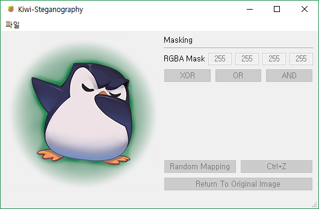

# kiwi-steg

**kiwi-steg** is a simple image manipulation tool. This project was first planned for creating our own tools to use in CTF steganography prob. You can transform pixel bits whatever you want!


(https://github.com/Team-Lapio/kiwi-steg/wiki)

## Features

- Transform bits in custom pattern
- Will be added later on...

## Installation

This will install all the packages you need to develop kiwi-steg.

```bash
python setup.py install
```